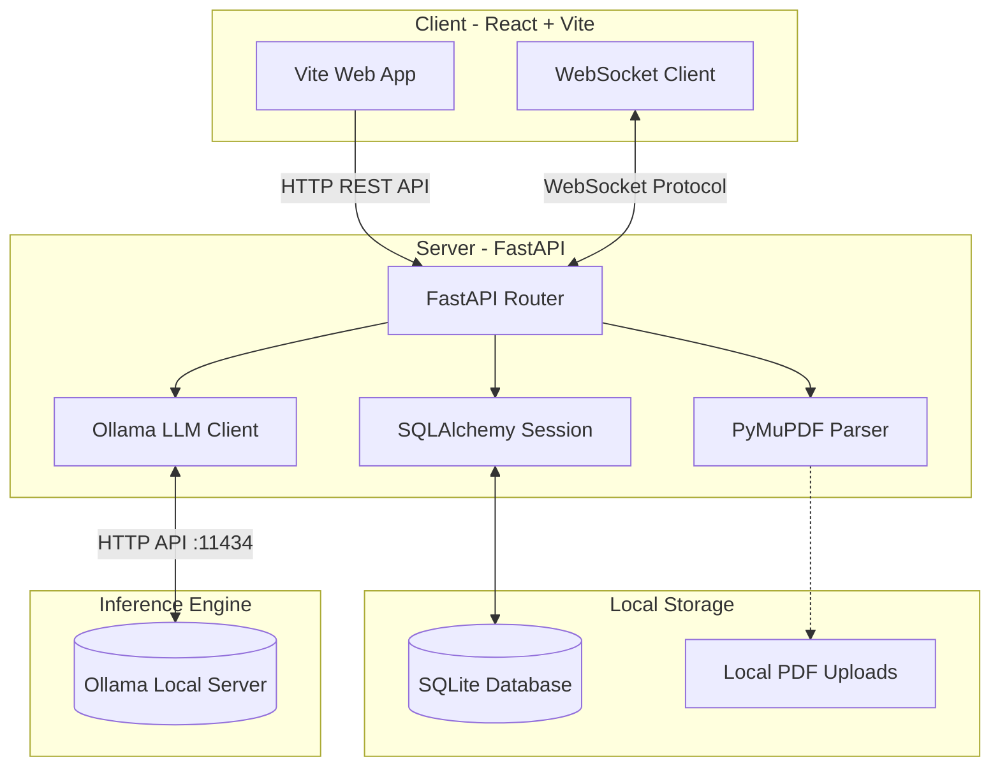

# 🚀 CareerPilot AI

[](https://python.org)
[](https://fastapi.tiangolo.com)
[](https://react.dev)
[](https://ollama.com)
[](https://sqlite.org)
[](https://vite.dev)

**CareerPilot AI** is a privacy-first, fully local, AI-powered career assistant and job application management platform. By utilizing **FastAPI** on the backend, **React & Vite** on the frontend, and a locally running **Ollama** LLM (`llama3.2:1b`), it acts as your personal career copilot—allowing you to parse resumes, analyze job postings, generate tailored cover letters and recruiter outreach messages, organize applications, and prepare for interviews, all without sending your personal data to external APIs.

---

## 🏗️ System Architecture

The following diagram illustrates the flow of data within CareerPilot AI:



---

## ✨ Key Features

1. **📄 Local PDF Resume Parsing**
   - Extracts raw text using `PyMuPDF` (Fitz).
   - Local LLM parses the unstructured text into a clean career profile schema (summary, skills, projects, experience, education).

2. **🎯 Intelligent Job Matching & Score Analysis**
   - Evaluates any job description against your career profile.
   - Computes a percentage-based match score and outputs a detailed compatibility report identifying key skills, overlaps, and gaps.

3. **✍️ Custom Cover Letters & Outreach Messages**
   - Automatically generates highly tailored, professional cover letters.
   - Drafts short, actionable recruiter messages (under 150 words) suited for LinkedIn or email outreach.

4. **💼 Kanban-ready Application Tracker**
   - Keeps track of all target roles, companies, status updates (`applied`, `interview`, `offer`, `rejected`), application URLs, and custom notes.

5. **🧠 Smart Interview Preparation**
   - Generates custom preparation guides featuring:
     - Company overview, culture context, and recent news summary.
     - **8 to 10 Tailored Interview Questions** (technical, behavioral, and role-specific) along with high-quality suggested answers.
     - **3 to 4 STAR Method Answers** mapped precisely from the candidate's actual projects/experience.

6. **💬 Real-Time AI Chat Assistant (WebSocket)**
   - Integrates a persistent conversational interface.
   - Allows users to ask questions, view their current profile, create applications by pasting job descriptions directly into chat, or get instant interview advice via streaming messages.

---

## 🛠️ Tech Stack

### Backend
* **Language:** Python 3.10+
* **Framework:** FastAPI (Asynchronous lifespan handlers)
* **ORM:** SQLAlchemy (declarative base)
* **Database:** SQLite (optimized with WAL mode & foreign key validation)
* **Libraries:** `pymupdf` (PDF extraction), `httpx` (async HTTP calls to Ollama), `pydantic` (validation schemas), `websockets` (real-time chat)

### Frontend
* **Build System:** Vite
* **UI Library:** React 19 (Hooks state management)
* **Styling:** Vanilla CSS
* **Code Quality:** Oxlint

### AI Engine
* **Local Inference:** Ollama
* **Default Model:** `llama3.2:1b` (configured in `config.py` for CPU-friendly speed and lightweight resources)

---

## 🚀 Local Setup & Installation

Follow these steps to run CareerPilot AI on your local environment:

### Prerequisites
1. **Python 3.10 or higher** installed.
2. **Node.js 18+ & npm** installed.
3. **Ollama** installed locally.

### 1. Configure and Start Ollama
Install Ollama from [ollama.com](https://ollama.com) and pull the default Llama model:
```bash
# Pull the lightweight Llama 3.2 1B model (default)
ollama pull llama3.2:1b

# Start the Ollama local service
ollama serve
```

### 2. Set Up the Backend
Clone the repository and install Python requirements:
```bash
# Navigate to the backend directory
cd backend

# Create a virtual environment
python -m venv venv

# Activate virtual environment
# On Windows (Command Prompt):
venv\Scripts\activate.bat
# On Windows (PowerShell):
venv\Scripts\Activate.ps1
# On Linux/macOS:
source venv/bin/activate

# Install dependencies
pip install -r requirements.txt
```

Start the FastAPI application:
```bash
uvicorn main:app --reload
```
*The backend server starts on `http://127.0.0.1:8000`.*
*The database automatically creates a SQLite file under `backend/data/career_pilot.db` upon startup.*

### 3. Set Up the Frontend
Open a new terminal session, navigate to the frontend directory, install dependencies, and start the development server:
```bash
# Navigate to the frontend directory
cd frontend

# Install node packages
npm install

# Run the dev server
npm run dev
```
*The React application will be accessible at `http://localhost:5173`.*

---

## 🔌 API Reference Guide

### 1. REST Endpoints

All endpoints are prefixed with `/api`.

| Category | HTTP Method | Endpoint | Description | Request Payload | Response Body |
| :--- | :--- | :--- | :--- | :--- | :--- |
| **Health** | `GET` | `/health` | Check backend server status and Ollama availability | None | `{"status": "ok", "ollama": true}` |
| **Resume** | `POST` | `/resume/upload` | Upload resume PDF, parse text, and create/update profile | `multipart/form-data` (file: `.pdf`) | `ProfileResponse` (parsed resume fields) |
| **Profile** | `GET` | `/profile` | Retrieve the parsed career profile | None | `ProfileResponse` |
| | `PUT` | `/profile` | Manually update profile details | `ProfileUpdate` | `ProfileResponse` |
| **Applications** | `POST` | `/jobs/analyze` | Submit job description for match analysis and save it | `JobAnalyzeRequest` | `ApplicationResponse` (with match details) |
| | `GET` | `/applications` | List all applications, optionally filtering by status | Query param: `status` (optional) | `list[ApplicationResponse]` |
| | `GET` | `/applications/{id}`| Fetch details of a single job application | None | `ApplicationResponse` |
| | `PATCH` | `/applications/{id}`| Update status or custom notes on an application | `ApplicationUpdate` | `ApplicationResponse` |
| | `DELETE`| `/applications/{id}`| Delete application and associated interview preps | None | `{"detail": "Application deleted."}` |
| **Interview** | `POST` | `/interview/prepare/{app_id}` | Generate interview prep guide using local LLM | None | `InterviewPrepResponse` |
| | `GET` | `/interview/{app_id}` | Retrieve prep guide for an application | None | `InterviewPrepResponse` |
| | `PUT` | `/interview/{app_id}` | Update personal preparation notes | `InterviewNotesUpdate` | `InterviewPrepResponse` |
| **Chat** | `GET` | `/chat/history` | Get the last 50 chat messages from history | None | `list[ChatMessageResponse]` |

### 2. WebSocket Connection

* **Connection URL:** `ws://localhost:8000/ws/chat`
* **Protocol:** JSON messages
* **Incoming Client Format:**
  ```json
  {
    "content": "Analyze this job: We need a backend developer with Python..."
  }
  ```
* **Outgoing Assistant Format:**
  - Standard text or streaming response:
    ```json
    {
      "type": "assistant_text",
      "content": "Analyzing this job against your profile..."
    }
    ```
  - Action commands for UI routing (e.g. show upload widget, show tracker):
    ```json
    {
      "type": "action",
      "action_type": "application_created",
      "data": { "application_id": 5 }
    }
    ```

---

## 🧪 Automated Testing

CareerPilot AI includes testing scripts to run verification checks on both static mock scenarios and the live-running instance.

```bash
cd backend
```

* **Integration Unit Tests (Mock client):**
  ```bash
  python tests/test_full_flow.py
  ```
* **Live Integration Tests (Against running server at port 8000):**
  ```bash
  python tests/test_live_server.py
  ```

---

## 📁 Repository Structure

```text
career_pilot/
├── .serena/                 # Serena project settings
├── backend/
│   ├── data/                # SQLite database folder (Git ignored)
│   ├── routers/             # FastAPI Endpoint Routers
│   │   ├── applications.py
│   │   ├── chat.py
│   │   ├── interview.py
│   │   ├── profile.py
│   │   └── resume.py
│   ├── samples/             # Sample resumes for testing
│   ├── services/            # Core business logic & LLM interfaces
│   │   ├── interview_prep.py
│   │   ├── job_analyzer.py
│   │   ├── llm_client.py
│   │   ├── profile_service.py
│   │   └── resume_parser.py
│   ├── tests/               # Backend Integration Tests
│   ├── config.py            # Global backend settings (Ollama model, db paths)
│   ├── database.py          # SQLAlchemy Session setup
│   ├── main.py              # Application entrypoint & CORS middleware
│   ├── models.py            # Database tables
│   ├── schemas.py           # Pydantic data schemas
│   └── requirements.txt     # Python backend dependencies
└── frontend/
    ├── public/              # Static public resources
    ├── src/                 # React source code
    │   ├── assets/          # Static assets & SVGs
    │   ├── App.css          # Main view styles
    │   ├── App.jsx          # React app entry layout
    │   ├── index.css        # Global CSS layout rules
    │   └── main.jsx         # React DOM renderer
    ├── package.json         # Node scripts & dependencies
    ├── vite.config.js       # Vite bundler configurations
    └── README.md            # Frontend overview guide
```

---

## 📄 License

This project is licensed under the MIT License. See the [LICENSE](LICENSE) file for more information.
