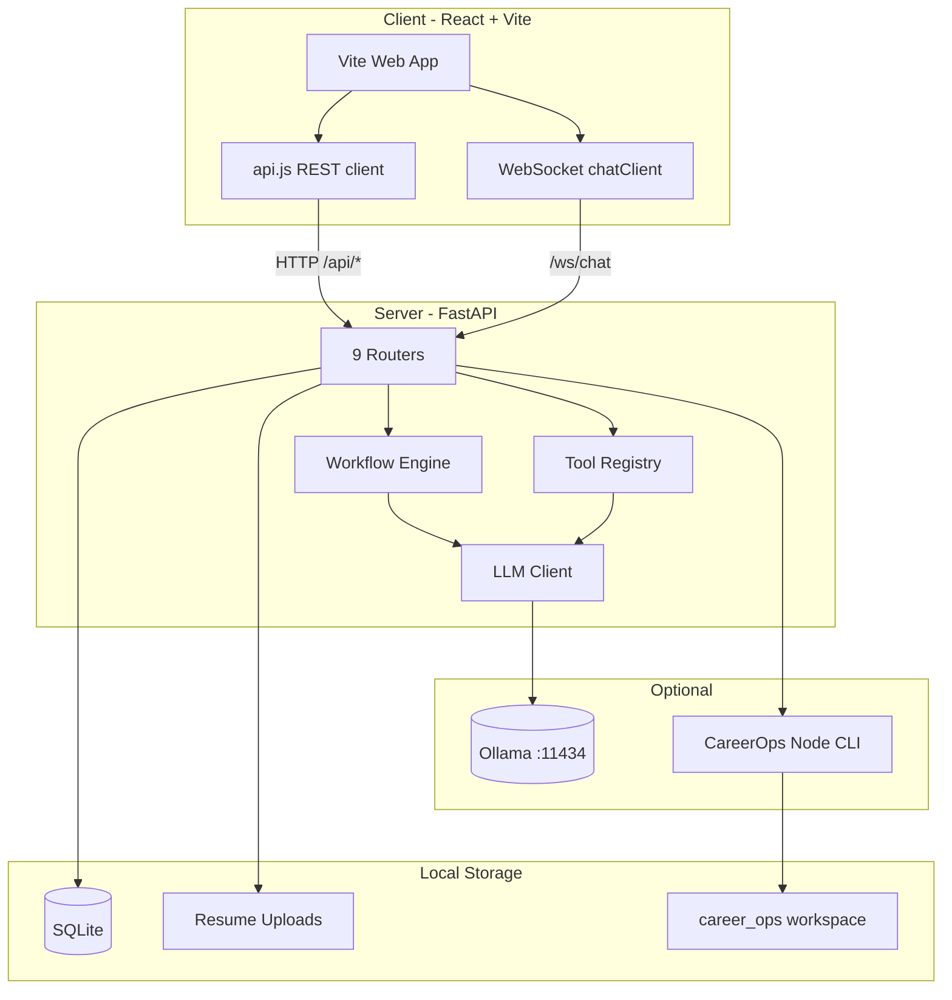

# 🚀 CareerPilot AI

[](https://python.org)
[](https://fastapi.tiangolo.com)
[](https://react.dev)
[](https://ollama.com)
[](https://sqlite.org)
[](https://vite.dev)

**CareerPilot AI** is a privacy-first, fully local, AI-powered career assistant and job application management platform. By utilizing **FastAPI** on the backend, **React & Vite** on the frontend, and a locally running **Ollama** LLM (`llama3.2:1b`), it acts as your personal career copilot—allowing you to parse resumes, analyze job postings, generate tailored cover letters and recruiter outreach messages, organize applications, and prepare for interviews, all without sending your personal data to external APIs.

---

## 🏗️ System Architecture

The following diagram illustrates the flow of data within CareerPilot AI:



---

## ✨ Key Features

1. **📄 Local PDF Resume Parsing**
   - Extracts raw text using `PyMuPDF` (Fitz).
   - Local LLM parses the unstructured text into a clean career profile schema (summary, skills, projects, experience, education).

2. **🎯 Intelligent Job Matching & Score Analysis**
   - Evaluates any job description against your career profile.
   - Computes a percentage-based match score and outputs a detailed compatibility report identifying key skills, overlaps, and gaps.

3. **✍️ Custom Cover Letters & Outreach Messages**
   - Automatically generates highly tailored, professional cover letters.
   - Drafts short, actionable recruiter messages (under 150 words) suited for LinkedIn or email outreach.

4. **💼 Kanban-ready Application Tracker**
   - Keeps track of all target roles, companies, status updates (`applied`, `interview`, `offer`, `rejected`), application URLs, and custom notes.

5. **🧠 Smart Interview Preparation**
   - Generates custom preparation guides featuring:
     - Company overview, culture context, and recent news summary.
     - **8 to 10 Tailored Interview Questions** (technical, behavioral, and role-specific) along with high-quality suggested answers.
     - **3 to 4 STAR Method Answers** mapped precisely from the candidate's actual projects/experience.

6. **💬 Real-Time AI Chat Assistant (WebSocket)**
   - Integrates a persistent conversational interface.
   - Allows users to ask questions, view their current profile, create applications by pasting job descriptions directly into chat, or get instant interview advice via streaming messages.

---

## 🛠️ Tech Stack

### Backend
* **Language:** Python 3.10+
* **Framework:** FastAPI (Asynchronous lifespan handlers)
* **ORM:** SQLAlchemy (declarative base)
* **Database:** SQLite (optimized with WAL mode & foreign key validation)
* **Libraries:** `pymupdf` (PDF extraction), `httpx` (async HTTP calls to Ollama), `pydantic` (validation schemas), `websockets` (real-time chat)

### Frontend
* **Build System:** Vite
* **UI Library:** React 19 (Hooks state management)
* **Styling:** Vanilla CSS
* **Code Quality:** Oxlint

### AI Engine
* **Local Inference:** Ollama
* **Default Model:** `llama3.2:1b` (configured in `config.py` for CPU-friendly speed and lightweight resources)

---

## 🚀 Local Setup & Installation

Follow these steps to run CareerPilot AI on your local environment:

### Prerequisites
1. **Python 3.10 or higher** installed.
2. **Node.js 18+ & npm** installed.
3. **Ollama** installed locally.

### 1. Configure and Start Ollama
Install Ollama from [ollama.com](https://ollama.com) and pull the default Llama model:
```bash
# Pull the lightweight Llama 3.2 1B model (default)
ollama pull llama3.2:1b

# Start the Ollama local service
ollama serve
```

### 2. Set Up the Backend
Clone the repository and install Python requirements:
```bash
# Navigate to the backend directory
cd backend

# Create a virtual environment
python -m venv venv

# Activate virtual environment
# On Windows (Command Prompt):
venv\Scripts\activate.bat
# On Windows (PowerShell):
venv\Scripts\Activate.ps1
# On Linux/macOS:
source venv/bin/activate

# Install dependencies
pip install -r requirements.txt
```

Start the FastAPI application:
```bash
uvicorn main:app --reload
```
*The backend server starts on `http://127.0.0.1:8000`.*
*The database automatically creates a SQLite file under `backend/data/career_pilot.db` upon startup.*

### 3. Set Up the Frontend
Open a new terminal session, navigate to the frontend directory, install dependencies, and start the development server:
```bash
# Navigate to the frontend directory
cd frontend

# Install node packages
npm install

# Run the dev server
npm run dev
```
*The React application will be accessible at `http://localhost:5173`.*

*The React application will be accessible at `http://localhost:5173`. The Vite dev server proxies `/api` and `/ws` to the backend at `http://127.0.0.1:8000`.*

---

## 🔌 API Reference Guide

### Backend Routers

| Router | Prefix | Key endpoints |
| :--- | :--- | :--- |
| `resume` | `/api/resume` | upload, upload history, download, delete |
| `profile` | `/api/profile` | GET/PUT profile, generate AI profile |
| `applications` | `/api` | jobs/analyze, applications CRUD, cover-letter |
| `interview` | `/api/interview` | prepare, get, update notes, interview kit |
| `chat` | `/api/chat`, `/ws/chat` | WebSocket chat, REST chat, history, pipeline |
| `tools` | `/api/tools` | list, categories, execute |
| `careerops` | `/api/careerops` | sync, scan, evaluate, pdf, cover-letter |
| `personas` | `/api/personas` | generate, list, get, delete |
| `memory` | `/api/memory` | career memory store/retrieve |

### Frontend API Layer

The frontend connects to the backend via [`frontend/src/services/api.js`](frontend/src/services/api.js) (REST) and [`frontend/src/services/chatClient.js`](frontend/src/services/chatClient.js) (WebSocket). Wired pages:

- **Profile** — resume upload, profile, personas
- **Job Analysis** — `/api/jobs/analyze`, cover letter, resume PDF
- **Applications (Kanban)** — `/api/applications` CRUD, interview prep
- **Workspace (AI Chat)** — WebSocket `/ws/chat`

Set `VITE_API_URL=http://127.0.0.1:8000` in production builds; dev uses Vite proxy.

### REST Endpoints (summary)

All endpoints are prefixed with `/api`.

| Category | HTTP Method | Endpoint | Description |
| :--- | :--- | :--- | :--- |
| **Health** | `GET` | `/health` | Server + LLM provider status |
| **Resume** | `POST` | `/resume/upload` | Upload PDF/DOCX, parse, create profile |
| **Profile** | `GET/PUT` | `/profile` | Career profile CRUD |
| | `POST` | `/profile/generate` | AI-enhanced profile generation |
| **Applications** | `POST` | `/jobs/analyze` | Analyze JD, save application |
| | `GET/PATCH/DELETE` | `/applications/{id}` | Application CRUD |
| **Interview** | `POST` | `/interview/prepare/{id}` | Generate interview prep |
| **Personas** | `POST/GET` | `/personas/generate`, `/personas` | AI career personas |
| **CareerOps** | `POST` | `/careerops/sync`, `/scan`, `/evaluate` | CareerOps integration |
| **Chat** | `POST` | `/chat` | REST chat fallback |
| | `GET` | `/chat/history` | Chat message history |

### 2. WebSocket Connection

* **Connection URL:** `ws://localhost:8000/ws/chat`
* **Protocol:** JSON messages
* **Incoming Client Format:**
  ```json
  {
    "content": "Analyze this job: We need a backend developer with Python..."
  }
  ```
* **Outgoing Assistant Format:**
  - Standard text or streaming response:
    ```json
    {
      "type": "assistant_text",
      "content": "Analyzing this job against your profile..."
    }
    ```
  - Action commands for UI routing (e.g. show upload widget, show tracker):
    ```json
    {
      "type": "action",
      "action_type": "application_created",
      "data": { "application_id": 5 }
    }
    ```

---

## 🧪 Automated Testing

```powershell
cd backend
.\venv\Scripts\Activate.ps1
pip install -r requirements.txt pytest
python -m pytest tests/ --ignore=tests/test_live_server.py --ignore=tests/test_full_flow.py -q
```

- **Live server tests** (requires `uvicorn main:app --reload` running): `python -m pytest tests/test_live_server.py`
- **Script-style smoke test**: `python tests/test_full_flow.py`

Phase 4 tests: `test_resume_upload.py`, `test_resume_parsing.py`, `test_profile_generation.py`, `test_personas.py`, `test_careerops.py`

---

## 📁 Repository Structure

```text
career_pilot/
├── backend/
│   ├── routers/             # resume, profile, applications, interview, chat, tools, careerops, personas, memory
│   ├── services/            # LLM, workflows, tools, CareerOps, personas, pipeline
│   ├── tests/               # 20 pytest files
│   └── main.py
├── frontend/
│   └── src/
│       ├── pages/           # Dashboard, Profile, JobAnalysis, Applications, Workspace, etc.
│       └── services/        # api.js, chatClient.js
├── career-ops-src/          # Vendored CareerOps CLI
├── career_ops/              # Synced CareerOps workspace
└── phases.md                # Development roadmap & phase status
```

---

## 📄 License

This project is licensed under the MIT License. See the [LICENSE](LICENSE) file for more information.
